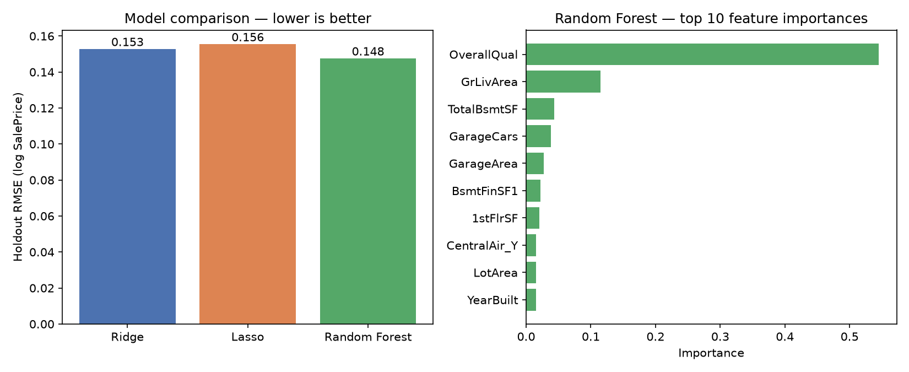

# Ames Housing Price Prediction

Predicts residential sale prices from structural and quality features using
two regularized linear models and a Random Forest, then compares them head
to head on the same held-out data. Originally built in R (`glmnet` +
`caret`) for a 2021 MSBA predictive-analytics course; rebuilt here in
Python/scikit-learn to match this portfolio's stack, with the methodology
re-verified rather than carried forward as fact.

## Data

**Real, public competition data — not synthetic.** Kaggle's "House Prices:
Advanced Regression Techniques" (the Ames, Iowa housing dataset, Dean De
Cock 2011): 1,460 labeled home sales, 79 structural/quality/location
predictors plus `SalePrice`. `data/train.csv` is the original competition
file; `data/data_description.txt` is Kaggle's own field documentation.

**Evaluation note, stated plainly:** the original 2021 coursework scored its
models by submitting predictions to Kaggle's leaderboard against the
competition's separate, unlabeled `test.csv` (logged there at the time:
Ridge RMSE ≈0.135, Lasso RMSE ≈0.130 on log-SalePrice). This rebuild only
has the labeled `train.csv` — no Kaggle account or leaderboard access here —
so every number below comes from an 80/20 train/holdout split of that same
1,460-row set instead (`random_state=42`). The results are methodologically
comparable, not a reproduction of the original leaderboard scores.

## Method

1. **Domain-aware missing-value handling** — most "missing" values in this
   dataset aren't unknown, they mean the house doesn't have that feature:
   `PoolQC`, `FireplaceQu`, the `Garage*`/`Bsmt*` quality fields, etc. all
   get an explicit `"None"` category rather than being dropped or imputed as
   if the data were absent by accident. `LotFrontage` (median) and
   `Electrical` (mode) are the only two genuinely-imputed fields.
2. **Log-transformed target** (`log1p(SalePrice)`) — sale prices are
   right-skewed; modeling the log makes the regression's normality
   assumptions far more reasonable and matches how the competition itself
   is scored.
3. **One-hot encoding** of all categorical fields — 259 features after
   encoding, from 79 original columns.
4. **Ridge and Lasso**, each standardized and tuned via 10-fold
   cross-validated grid search over its regularization strength — same
   approach as the original `glmnet` cross-validation, just in scikit-learn.
5. **Random Forest** (500 trees) as a non-linear comparison point, with
   feature importances extracted directly rather than assumed.

All three models are fit on the same 1,168-row training split and scored on
the same 292-row holdout split they never saw during training or tuning.

## Findings (real output, `output/results.json` / `output/chart.png`)

| Model | Holdout RMSE (log SalePrice) | Holdout R² | Holdout MAE ($) |
|---|---|---|---|
| Ridge (α=354.6) | 0.153 | 0.875 | $17,080 |
| Lasso (α=0.0043) | 0.156 | 0.870 | $16,754 |
| Random Forest | **0.148** | **0.883** | $17,595 |



Random Forest wins on RMSE/R², but **not on every metric**: Lasso actually
has the lowest dollar-denominated MAE ($16,754 vs. Random Forest's
$17,595), because RMSE-on-log-price and raw-dollar MAE weight errors on
expensive vs. typical homes differently. Both are reported rather than
picking whichever number favors one "winner" — that mismatch is itself a
real, useful thing to notice when evaluating regression models on a skewed
target.

Random Forest's top predictor by a wide margin is `OverallQual` (a 1-10
material/finish quality rating), at nearly 5x the importance of the next
feature, `GrLivArea` (above-ground living area). `TotalBsmtSF`, `GarageCars`,
and `GarageArea` round out the top five — all structural/size measures, not
location or sale-timing fields, consistent with the correlation screen the
original 2021 coursework ran by hand before building any model.

Lasso zeroed out 151 of 259 one-hot-encoded features entirely at its chosen
`alpha` — a real, interpretable form of feature selection baked into the
model itself, distinct from Random Forest's importance ranking, which keeps
every feature but weights them.

**What this validates, stated plainly:** three genuinely different modeling
approaches (two regularized-linear, one tree-ensemble) converge on
R² ≈ 0.87–0.88 and broadly agree on which features matter most — a
reasonable, unsurprising result for a well-behaved, well-studied public
dataset. This is a baseline/comparison exercise, not a claim of
state-of-the-art performance; the public Kaggle leaderboard for this
competition has entries well below this RMSE range using more extensive
feature engineering and ensembling than done here.

## Running it

```bash
python -m venv .venv
.venv/Scripts/pip install -r requirements.txt   # Windows; .venv/bin/pip on macOS/Linux
.venv/Scripts/python train_model.py
```

Writes `output/results.json` (all three models' metrics, best
hyperparameters, and the Random Forest's top-10 feature importances) and
`output/chart.png` (model comparison + feature importances) from real,
locally-run scikit-learn output — nothing here is copied from the original
2021 coursework's numbers.
