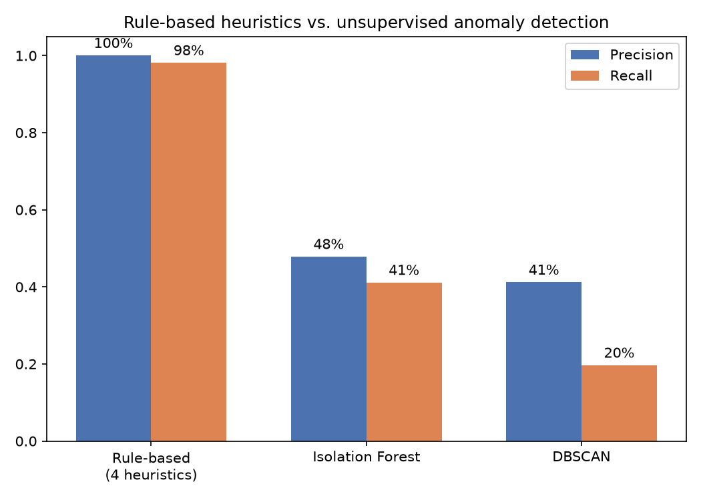
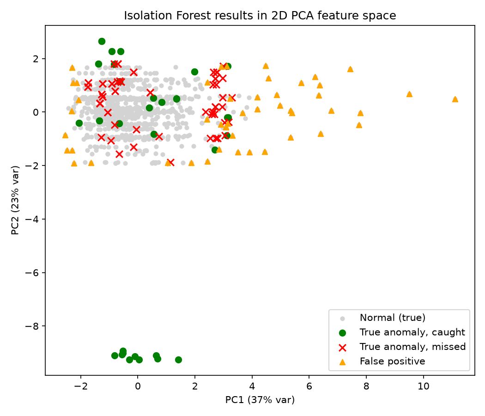

# Duplicate Payment Anomaly Detection (Unsupervised ML)

A net-new project, not a coursework rebuild: applies two real unsupervised
anomaly-detection techniques — **Isolation Forest** and **DBSCAN** — to the
same synthetic AP ledger the sibling
[Duplicate Vendor Payment Checker](../duplicate-vendor-payment-checker)
project already flags using four hand-built rules, then evaluates both
against the same seeded ground truth. The question isn't "does ML beat the
rules" (it doesn't, and shouldn't) — it's *how much* real signal a
general-purpose method can recover with no domain rules or hand-picked
thresholds, and what that costs in false positives: a real, honest
transparency/defensibility trade-off between packaged black-box-style
detection and rules an auditor can walk a reviewer through step by step.

## Data

**Same synthetic data as the sibling project, reused unchanged** —
`data/ledger.csv` (919 payments) and `data/ground_truth.json` (52 seeded
duplicate/anomalous groups), copied from
`duplicate-vendor-payment-checker/data/`. Nothing new generated; the point
of this project is a different analytical lens on the same real problem,
not a new dataset.

**Ground truth is used only for evaluation** (and for one disclosed,
labeled sensitivity check — see "Honest methodology notes" below) — never
as an input feature to either detector, matching the same discipline the
rule-based project holds itself to.

## Method

**Feature engineering** (7 features per payment, none of them a
hand-coded version of the rule-based checker's actual thresholds):

- `amount`, `log_amount`
- `vendor_payment_count` — how many payments this vendor has in total
- `same_vendor_same_amount_count` — how many *other* payments to this
  vendor share this exact amount (a generic statistical echo of the
  exact-duplicate/review-candidate patterns, not the hard rule itself)
- `min_days_to_other_payment_same_vendor` — temporal clustering signal
- `amount_zscore_within_vendor` — how unusual this amount is for this
  specific vendor
- `best_fuzzy_match_score_to_other_vendor` — this vendor's closest
  `rapidfuzz` name-similarity match to any other vendor in the ledger (a
  continuous echo of the rule-based checker's hard 90%-threshold
  vendor-master check)

Features are standardized, then fed to:

1. **Isolation Forest** (`scikit-learn`, 200 trees) — an isolation-based
   anomaly detector: rare points get separated from the rest by fewer
   random splits than typical points, so they end up with shorter average
   path lengths in the trees.
2. **DBSCAN** — a density-based clustering algorithm whose "noise" points
   (`label == -1`, points that don't fit densely enough into any cluster)
   double as a genuine, if secondary, notion of outlier.

**K-Means deliberately not used.** It partitions *all* points into K
roughly-balanced clusters — it isn't built to find a small minority of rare
outliers, which is what this problem actually is. Isolation Forest and
DBSCAN were both purpose-built for exactly that; picking a technique
because it's genuinely the right shape for the problem, not just because
it's a well-known name, is itself the point of this build.

## Findings (real output, `output/results.json` and the charts below)

| Method | Precision | Recall | Unit of analysis |
|---|---|---|---|
| Rule-based (4 heuristics, sibling project) | 100% | 98.1% | seeded group (52 groups) |
| Isolation Forest | 47.8% | 41.1% | individual payment (919 payments) |
| DBSCAN | 41.2% | 19.6% | individual payment (919 payments) |



**The rule-based numbers aren't a strictly apples-to-apples comparison** —
they're evaluated at the seeded-*group* level (does the checker raise a
flag connecting the right payments), while the two detectors here are
evaluated at the individual-*payment* level (is this one payment flagged at
all). Both are reported plainly rather than forced into one misleading
number; the gap is real either way.

**Isolation Forest recovers genuine signal, not noise**: 47.8% precision
against an 11.6% true anomaly rate is roughly **4x better than chance** —
a random detector flagging 10% of payments would land near 11.6%
precision by construction. It's real, useful signal; it's just
substantially weaker than four rules built specifically for these four
seeded patterns, which is the expected and honest result, not a failure.



**A genuinely interesting, unplanned pattern in the PCA plot**: a tight
cluster of true anomalies sits clearly separated from everything else
(bottom of the plot) — payments with an unusually short
`min_days_to_other_payment_same_vendor` *combined with* a high
`same_vendor_same_amount_count`, which Isolation Forest catches easily.
Most of the *missed* anomalies, by contrast, sit scattered inside the
normal-looking cloud — largely the vendor-master fuzzy-duplicate cases,
where the fuzzy-match feature alone isn't a strong enough statistical
outlier signal on its own to separate from normal variation. That's a real,
specific explanation for *why* recall tops out where it does, not just a
number.

## Honest methodology notes

- **Primary runs use a round, assumed 10% anomaly rate** (Isolation
  Forest's `contamination`, DBSCAN's `eps` percentile target) — a
  plausible domain-judgment guess, not the true seeded rate (11.6%),
  which would have quietly leaked label information into an otherwise
  unsupervised method's core configuration.
- **A separate, clearly-labeled sensitivity check** grid-searches
  `contamination`/`eps` against the real labels to find the best
  achievable F1 (Isolation Forest: F1 0.613 at contamination=0.21; DBSCAN:
  F1 0.349 at a tighter eps) — reported as an upper bound, not the headline
  number, since it requires label access a real unsupervised deployment
  wouldn't have at detection time.
- Every claimed number traces to `output/results.json` from a real run
  against real (synthetic) data — the rule-based comparison numbers come
  from re-running the sibling project's actual `check.py` against this
  exact copy of the data, not a remembered or re-typed figure.

## Running it

```bash
python -m venv .venv
.venv/Scripts/pip install -r requirements.txt   # Windows; .venv/bin/pip on macOS/Linux
.venv/Scripts/python detect_anomalies.py
```

Writes `output/results.json` (every number above) and both charts from a
real, local run.
