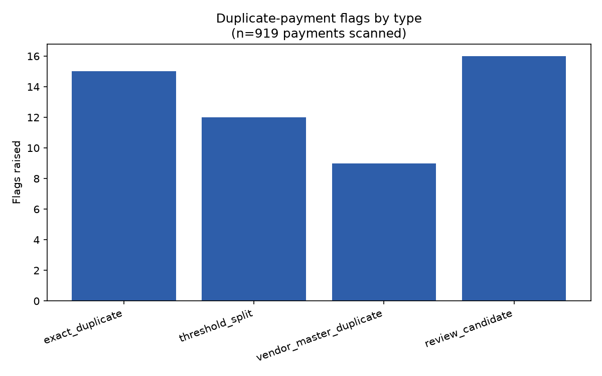

# Duplicate Vendor Payment Checker

Scans an accounts-payable ledger for potential duplicate payments using
four concrete, named internal-audit AP-recon techniques — not one opaque
similarity score. Classic internal-audit analytics use case: catching
double payments, structured/split payments, and duplicate vendor-master
records before or after they clear.

## Data

**Synthetic, not real financial data.** `generate_ledger.py` generates a
one-year, ~900-payment ledger (50 procedurally-named vendors, realistic
amount distribution, deterministic via a fixed random seed) and
deliberately seeds four known duplicate/near-duplicate patterns into it.
The seeded ground truth (`data/ground_truth.json`) is kept separate from
the ledger the checker actually reads (`data/ledger.csv`) — `check.py`'s
detection logic never opens `ground_truth.json`. It exists purely so this
README can report real precision/recall against known cases, which is the
one thing labeled synthetic data can do that a real audit engagement
can't: you don't usually get to know exactly what you missed.

## Method

Four heuristics, each a real AP-recon technique used in practice, run
independently and their flags combined:

1. **Exact duplicate** — same vendor, same invoice number, same amount,
   paid more than once. The simplest and most confident case (double
   keying, a resubmitted invoice paid twice).
2. **Threshold split** — two or more payments to the same vendor, each
   individually just under a defined approval threshold ($10,000 here,
   within 12%), within a 14-day window. This is the standard
   "structuring" pattern: splitting one obligation into several payments
   to duck an approval control, whether deliberate or an artifact of how
   an invoice got processed.
3. **Vendor-master duplicate** — the same invoice number and amount paid
   under two different-but-similar vendor names (fuzzy name match via
   `rapidfuzz.fuzz.token_sort_ratio`, threshold 90). This points at a root
   cause internal audit cares about specifically: duplicate vendor-master
   records in the AP system, which is what actually *enables* the
   duplicate payment rather than being the payment error itself.
4. **Review candidate** — same vendor, same amount, different invoice
   number, within 30 days. Deliberately the lowest-confidence tier:
   flagged for manual review, not asserted as a duplicate, since a vendor
   legitimately billing the same round amount twice (a recurring service
   fee, for example) looks identical to this pattern.

## Findings (real output, `output/flagged.json` / `output/chart.png`)

Run against the generated 919-payment ledger, 52 seeded duplicate/review
groups:

| Metric | Value |
|---|---|
| Payments scanned | 919 |
| Total flags raised | 52 |
| Exact duplicate flags | 15 |
| Threshold-split flags | 12 |
| Vendor-master-duplicate flags | 9 |
| Review-candidate flags | 16 |
| Recall vs. seeded groups | 51 / 52 (98%) |
| Precision (flags that trace to a real seeded case) | 52 / 52 (100%) |



Recall by pattern type:

| Pattern | Seeded | Caught | Recall |
|---|---|---|---|
| Exact duplicate | 15 | 15 | 100% |
| Threshold split | 12 | 12 | 100% |
| Vendor-master duplicate | 10 | 9 | 90% |
| Round-trip near-duplicate (review tier) | 15 | 15 | 100% |

**The one miss, reported honestly, not smoothed over:** vendor names
`"Lumen Utilities"` and `"Lumen Utilities LLC"` (same invoice number,
same $831.03 amount) scored an 88.2% fuzzy-match ratio — just under the
90% threshold — so that pair went undetected. This is a real, structural
limitation of the technique, not a bug: `token_sort_ratio` penalizes an
entire extra token ("LLC") more heavily than it penalizes character-level
edits like a dropped period, so a threshold tuned to skip past
punctuation noise (catching e.g. `"Acme Co."` vs `"Acme Co"`) can miss a
legal-suffix variant. Lowering the threshold to catch this case would
also raise the false-positive risk on genuinely different, similarly-named
vendors — a real precision/recall tradeoff, not a free fix.

Zero false positives: every flag raised traces back to a seeded case.
Notably, one `review_candidate` flag (`PMT-00855` / `PMT-00918`) wasn't a
direct seed pair at all — it emerged because the two independent seeding
passes (exact-duplicate and round-trip-near-duplicate) happened to draw
the *same* underlying base payment as their source, producing a real
three-way relationship the checker correctly surfaced as an additional,
genuine pairing rather than noise.

**What this result actually means, stated plainly**: 98% recall and 100%
precision on this run is a strong result *for this synthetic ledger and
these seeded patterns* — it validates that the four heuristics are
correctly implemented and that the thresholds chosen (12% threshold
margin, 90% fuzzy-match ratio, 14/30-day windows) are reasonable starting
points. It is not a claim about real-world AP fraud-detection accuracy,
which depends heavily on an organization's actual invoice-numbering
conventions, vendor-master hygiene, and approval-threshold policy — this
is a validated baseline and a worked example of the method, the same
role the Benford's Law analyzer's real-SEC-data run played for that
project.

## Running it

```bash
python -m venv .venv
.venv/Scripts/pip install -r requirements.txt   # Windows; .venv/bin/pip on macOS/Linux
.venv/Scripts/python generate_ledger.py
.venv/Scripts/python check.py
```

Writes `data/ledger.csv` (the checker's input) and `data/ground_truth.json`
(seeded cases, for scoring only) from the first command; `output/flagged.json`
(all flags plus the precision/recall scoring) and `output/chart.png`
(flag counts by type) from the second.
