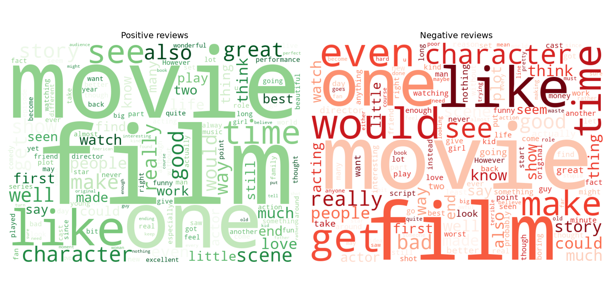
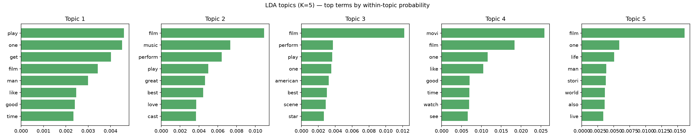
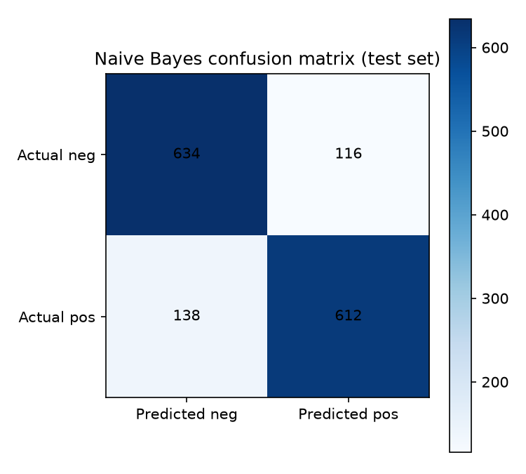

# IMDB Review Text Analytics

Classical (pre-LLM) NLP toolkit applied to 5,000 real movie reviews:
document-term matrices, TF-IDF, comparative word clouds, LDA topic modeling,
lexicon-based sentiment scoring, a trained Naive Bayes sentiment classifier,
and POS-tagged entity extraction. Originally built in R (`quanteda`, `tm`,
`topicmodels`, `cleanNLP`) for a 2021 MSBA Text Analytics course; rebuilt
here in Python with the same technique set, plus two things the original
script set up but never finished (see "What changed from the original"
below).

## Data

**Real, public data — not synthetic.** The original coursework used a
5,000-review sample of Amazon Musical Instrument reviews
(`MusicalInstruments.csv`), but that file doesn't exist anywhere in the
source archive — only the analysis script survived — and Amazon review
corpora generally carry murkier redistribution terms. Substituted the
**Stanford Large Movie Review Dataset** (Maas et al., 2011,
<https://ai.stanford.edu/~amaas/data/sentiment/>), an unambiguously public
NLP research dataset: 50,000 labeled reviews, binary positive/negative.
`prepare_data.py` downloads it fresh, then draws the same-sized sample the
original project used — 5,000 reviews, balanced 2,500/2,500 — with a fixed
seed. `data/reviews_sample.csv` is that exact sample, committed so anyone
cloning this repo gets the real data used to produce the numbers below
without needing to re-download anything.

## Method

1. **HTML cleanup** — the raw dataset's review text still contains literal
   `<br />` line-break tags. Left unstripped, `br` becomes one of the most
   frequent "words" in the corpus — confirmed by an early draft run where it
   dominated both word clouds (see "A bug caught by looking at the actual
   chart" below). Stripped before any tokenization.
2. **Document-term matrix, twice** — once on raw tokens, once with
   stopwords removed and Porter-stemmed — to quantify what cleaning actually
   buys you: vocabulary size and sparsity, before vs. after.
3. **Comparative word clouds** (positive vs. negative reviews) and a
   **top-20-words bar chart** on the cleaned vocabulary.
4. **LDA topic modeling** (`scikit-learn`, K=5 topics), reporting held-out
   perplexity and each topic's top terms **as within-topic probabilities**,
   not raw pseudo-counts (see "A second bug, caught before publishing"
   below).
5. **Bing Liu lexicon sentiment scoring** — `nltk`'s built-in
   `opinion_lexicon` corpus is the same positive/negative word list the
   original R script loaded from local `.txt` files. Net score (positive
   words minus negative words) computed per review, then — unlike the
   original, which only plotted the scores — **validated against the real
   labels**: does a simple "net score > 0" rule actually predict sentiment?
6. **Naive Bayes classifier** — TF-IDF features, 70/30 train/test split
   (matching the original's `p = 0.7` partition), `MultinomialNB`. The
   original script built the train/test partition and checked class
   proportions but the actual model fit isn't in the surviving file; this
   completes it with a real accuracy/precision/recall/confusion-matrix
   result.
7. **POS-tagged entity extraction** — proper nouns (`NNP`) tagged across a
   100-review sample, same sample size as the original.

## Findings (real output, `output/results.json` and the charts below)

**DTM cleaning impact**: 38,092 raw terms → 25,557 after stopword removal
and stemming (both ~99.6% sparse — normal for a bag-of-words matrix over
5,000 short documents). Most frequent cleaned terms: `movi` (10,295),
`film` (9,544), `one` (5,551), `like` (4,476), `time` (3,152) — dominated by
generic movie-review vocabulary, as expected before any sentiment-specific
weighting.



**LDA topic modeling** (perplexity 3,122): with only 5 topics over reviews
that are overwhelmingly *about the same thing* (movies), separation is
real but modest — reported honestly rather than oversold. Topics 1, 4, and
5 stay close to generic review vocabulary (`film`, `one`, `like`, `good`).
Topics 2 and 3 pull out genuinely distinct signal: Topic 2 leans toward
musical/performance reviews (`music`, `perform`, `cast`, `love`), Topic 3
toward star-driven dramas (`american`, `scene`, `star`).



**Lexicon sentiment vs. ground truth**: the naive "net score > 0" rule gets
**71.9% accuracy** against the real labels — real separation (mean net
score +4.08 for positive reviews vs. −2.89 for negative), but with enough
overlap that a simple word-count lexicon is a meaningfully weaker signal
than a trained model (see below). The original script never checked this;
plotting sentiment scores without validating them against ground truth
would have been an easy way to overstate how well the lexicon works.

**Naive Bayes classifier**: **83.1% accuracy** (84.1% precision, 81.6%
recall) on a genuinely held-out 1,500-review test set — noticeably ahead of
the lexicon's 71.9%, the real, quantified case for why a trained model beats
a fixed word list on this task.

| | Predicted negative | Predicted positive |
|---|---|---|
| **Actual negative** | 634 | 116 |
| **Actual positive** | 138 | 612 |



**POS-tagged proper nouns** (100-review sample): mostly real actor/director/
character names surfaced correctly (`Michael`, `Ted`, `Claire`, `Andy`,
`Lubitsch`, `Buñuel`) — a sign the tagger and the HTML-stripping fix are
both working as intended (an earlier draft run, before that fix, surfaced
`<`, `>`, and `/` as the top "proper nouns" instead — see below).

## Two real bugs, caught before publishing

**HTML tag leakage.** The first full run's word clouds were dominated by
`br` — the leftover `<br />` line breaks in the raw dataset, mis-tokenized
as a real word. It was visibly the *largest* word in both the positive and
negative clouds before the fix. Caught by actually looking at the generated
chart rather than trusting the pipeline ran without errors, then fixed by
stripping HTML tags before any tokenization step and re-running everything.

**Unnormalized LDA topic weights.** The first LDA run reported one topic's
top term at a "weight" of ~10,244 against another topic's top term at
~272 — a 40x gap that looked like one topic had overwhelmed the others.
That's an artifact of `scikit-learn` exposing raw, unnormalized topic-word
pseudo-counts (`components_`), not probabilities — topics that absorb more
of the corpus have larger raw numbers regardless of how concentrated their
top words actually are. Fixed by normalizing each topic's row to a
probability distribution before reporting or plotting, so "weight" means
the same thing in every topic.

## What changed from the original

- **Dataset swapped** (Amazon → IMDB movie reviews) for licensing safety —
  see "Data" above.
- **Comparative word clouds by binary sentiment**, not 5-star rating —
  IMDB's public dataset only has positive/negative labels, unlike the
  original 1-5 star Amazon data.
- **Naive Bayes classifier completed**, not just partitioned — the
  surviving R script builds the train/test split and checks class
  proportions but the actual model fit isn't in the file.
- **Lexicon sentiment validated against ground truth**, which the original
  didn't do.

## Running it

```bash
python -m venv .venv
.venv/Scripts/pip install -r requirements.txt   # Windows; .venv/bin/pip on macOS/Linux
.venv/Scripts/python prepare_data.py             # only needed if data/reviews_sample.csv is missing
.venv/Scripts/python analyze_text.py
```

`prepare_data.py` downloads the ~80MB Stanford dataset into a local,
gitignored `raw/` folder and writes the committed `data/reviews_sample.csv`
sample — safe to skip since that file is already in the repo.
`analyze_text.py` downloads its required `nltk` corpora into a local,
gitignored `nltk_data/` folder on first run, then writes every file in
`output/` (all charts plus `results.json`) from a real, local run —
nothing here is copied from the original 2021 coursework's numbers.
