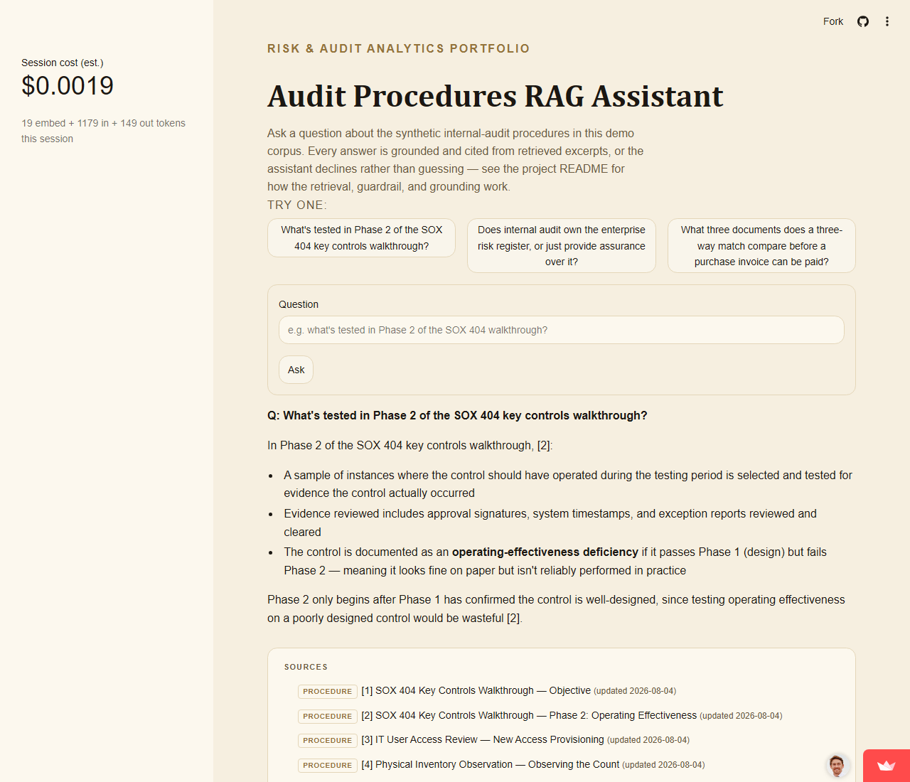
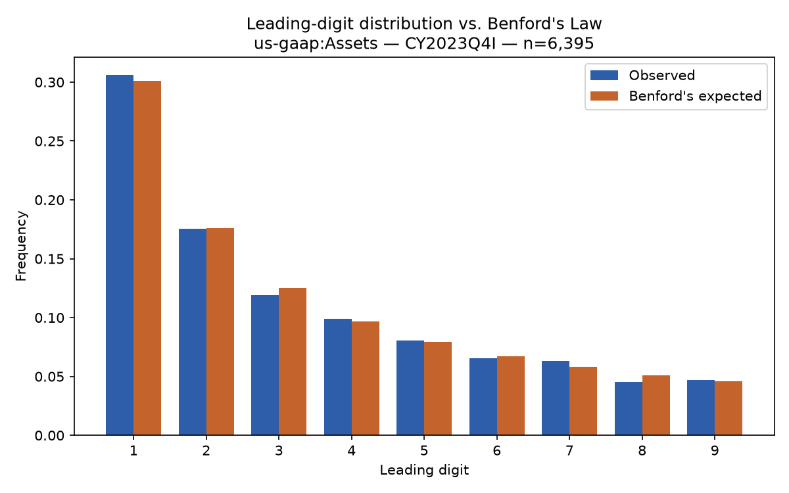
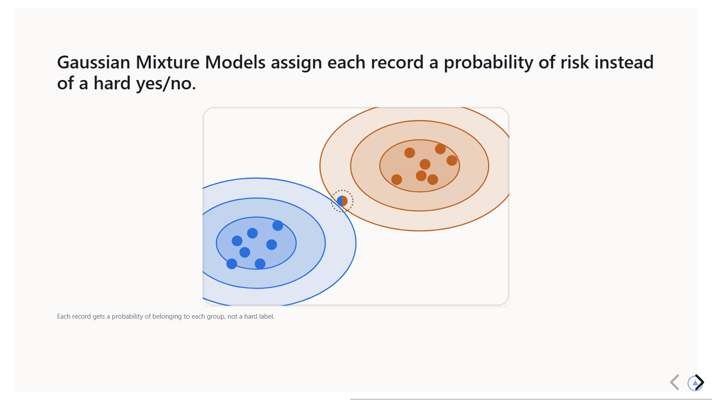

<button id="toggle-dark" style="position:fixed;top:1rem;right:1rem;z-index:1000;">🌙 Toggle Dark Mode</button>

---
layout: home
title: "Risk & Audit Analytics Portfolio"
description: "Data-driven internal audit, risk analytics, and automation projects by G. Seth Neifert"
---

# Welcome to My Risk & Audit Analytics Portfolio

I work in internal audit data analytics and am building toward applying
advanced analytics, machine learning, and automation to internal audit,
enterprise risk, and governance challenges. This site tracks real, working
projects as they ship — nothing here is a mockup or a hypothetical.

---

## 🔍 Projects

### Audit Procedures RAG Assistant

A retrieval-augmented question-answering assistant grounded in a
synthetic internal-audit procedures corpus — two-stage retrieval, a
groundedness guardrail that declines to answer rather than guess, and
full query logging. Includes a real debugging story: two retrieval bugs
found live by actually running the eval suite against real embeddings
(boilerplate cross-reference sections winning on title overlap, and a
section whose own opening sentence diluted its embedding), both
root-caused and fixed — see the project README.

[Source & write-up](https://github.com/neifertg/risk-analytics-portfolio/tree/main/audit-rag-assistant)
&middot; [Live demo](https://84abkcnqvptyedbbssztx8.streamlit.app/)

### Benford's Law Analyzer

Checks whether real, public financial-statement data conforms to
Benford's Law's expected leading-digit distribution — a classic
forensic-accounting screening technique. Run against ~6,400 real US
public companies' reported total assets (SEC EDGAR XBRL Frames API, no
synthetic data): chi-square p=0.20, Nigrini MAD=0.00324 (close
conformity) — the expected result for a healthy market-wide aggregate,
and a validated baseline for applying the same method to a narrower,
single-entity population where a deviation would actually be meaningful.

[Source, chart & real output](https://github.com/neifertg/risk-analytics-portfolio/tree/main/benfords-law-analyzer)

### Duplicate Vendor Payment Checker

Flags potential duplicate AP payments using four named, real audit
techniques (exact duplicates, threshold-avoidance "split" payments,
fuzzy-matched vendor-master duplicates, and lower-confidence review
candidates) rather than one opaque similarity score. Run against a
seeded synthetic ledger (919 payments, ground truth kept separate from
the detector's input): 98% recall, 100% precision — including one
honestly-reported miss where a vendor-name variant fell just short of
the fuzzy-match threshold, a real precision/recall tradeoff rather than
a hidden flaw.

[Source, findings & real output](https://github.com/neifertg/risk-analytics-portfolio/tree/main/duplicate-vendor-payment-checker)

### Presentation Deck Builder

A generator for branded, self-contained reveal.js training decks — content
authored as structured `deck.yaml`, rendered through a fixed set of layouts
and design tokens so every deck stays visually consistent without hand-tuned
CSS per talk. The example here, "Clustering for Audit Analytics," is a real
17-slide internal-training deck walking through K-Means, Hierarchical
Clustering, DBSCAN, and Gaussian Mixture Models, each framed as an audit
question rather than abstract ML theory, with two worked examples (vendor-
payment clustering, access-log clustering).

[Source & write-up](https://github.com/neifertg/risk-analytics-portfolio/tree/main/deck-builder)
&middot; [Live demo](deck-builder/decks/clustering-for-audit/index.html)

### Journal Entry Testing Analyzer

Flags potential fraud-risk journal entries using five risk criteria pulled
directly from AU-C 240 / PCAOB AS 2401's journal-entry-testing requirement —
unusual preparer, weekend/holiday posting, period-end cutoff timing,
round-dollar amounts with weak descriptions, and unusual account
combinations. Run against a seeded synthetic general ledger (2,586 entries,
86 seeded red flags, ground truth kept separate from the detector's input):
100% recall across all five criteria, with four running at 100% precision
too. The fifth — period-end cutoff — hits only 9.6% precision, reported
plainly rather than smoothed over: roughly 9% of any real ledger legitimately
falls within 2 days of month-end, so that criterion is a deliberately broad
population screen by nature, not a precise detector, matching how it's
actually used in practice.

[Source, findings & real output](https://github.com/neifertg/risk-analytics-portfolio/tree/main/journal-entry-testing-analyzer)

### Segregation-of-Duties Conflict Checker

Flags users holding both sides of a defined segregation-of-duties conflict
(e.g. creating a vendor master record and approving payments to it) based
on *current* active access, not raw grant history — classic IT-audit/GRC
analytics. Tests both failure modes a real SoD review has to catch: a
legacy role that bundles conflicting rights by design, and clean roles
where a person accumulated the other side through an active exception
grant. Run against a synthetic 220-user access population: 100% recall and
precision against 24 seeded active conflicts, plus a built-in true-negative
test (10 users whose conflicting exception grant was later revoked, all
correctly left unflagged). One real, unplanned finding the run surfaced:
a single user ended up holding all three procure-to-pay rights at once
(create, approve, *and* receive) through two independent seeded grants
landing on the same person — a compounding risk a simple pairwise matrix
can under-communicate.

[Source, findings & real output](https://github.com/neifertg/risk-analytics-portfolio/tree/main/sod-conflict-checker)

---

## 📄 Contact

- [GitHub](https://github.com/neifertg)
- [LinkedIn](https://www.linkedin.com/in/g-seth-neifert-7668b6b6/)
- [Email](mailto:gsneifert@gmail.com)

---

> "Better data leads to better questions. Better questions lead to better audits."

