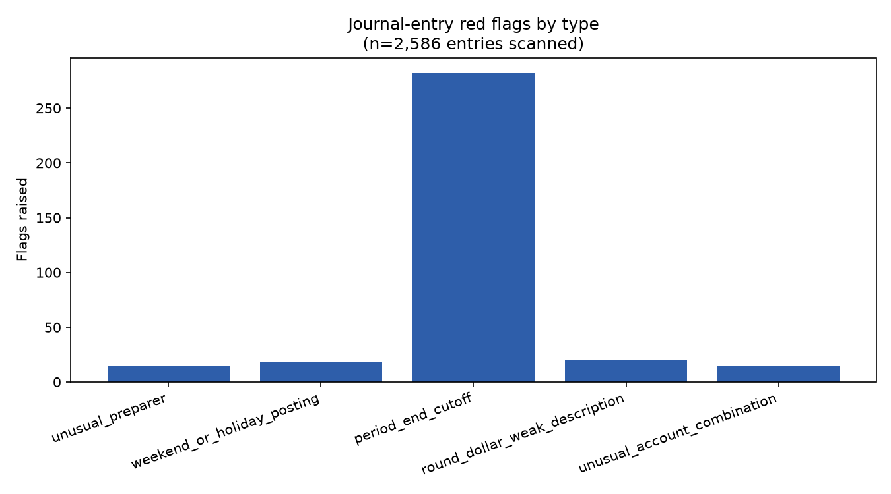

# Journal Entry Testing Analyzer

Flags potential fraud-risk journal entries in a general ledger using five
concrete risk criteria — not one opaque score. Journal entry testing isn't
optional best practice: AU-C 240 (US GAAS) and PCAOB AS 2401, both titled
*Consideration of Fraud in a Financial Statement Audit*, specifically
require auditors to design procedures that test journal entries for fraud
risk, separate from normal substantive testing, because financial-statement
fraud most often runs through manual entries that bypass routine
transaction-processing controls.

## Data

**Synthetic, not real financial data.** `generate_journal_entries.py`
generates a one-year, ~2,600-entry general ledger (18 role-based preparers,
15 realistic subledger-driven debit/credit account pairs across AP, AR,
Payroll, Fixed Assets, Inventory, Treasury, Tax, and Prepaids, deterministic
via a fixed random seed) and deliberately seeds 86 known red-flag entries
into it, one seeded category at a time, each varying only the one dimension
that trips its own detector (who posted it, when, the amount/description,
or the account pair) so every heuristic gets tested against a clean signal.
The seeded ground truth (`data/ground_truth.json`) is kept separate from the
ledger the checker actually reads (`data/journal_entries.csv`) —
`check.py`'s detection logic never opens it. It exists purely so this
README can report real precision/recall against known cases.

## Method

Five heuristics, lifted directly from the "Common risk criteria" list in
this portfolio author's own AI/ML learning wiki's `journal-entry-testing.md`
note (itself sourced from AU-C 240 / AS 2401), run independently and their
flags combined:

1. **Unusual preparer** — posted by someone who posts unusually few journal
   entries all year (population-wide frequency, not a hardcoded blocklist).
   Standards language: "users who don't normally post journal entries, or
   senior personnel who could override normal review."
2. **Weekend or holiday posting** — dated on a Saturday, Sunday, or a
   recognized federal holiday.
3. **Period-end cutoff** — posted within 2 calendar days of month-end,
   where cutoff manipulation risk concentrates.
4. **Round-dollar amount + weak description** — both conditions together,
   deliberately, since either alone is common in legitimate entries (a
   payroll run is often a round number; a short description isn't
   inherently suspicious). Requiring both cuts the false-positive rate a
   lot without giving up real recall.
5. **Unusual account combination** — a debit/credit account pair that's
   statistically rare across the whole ledger, which also catches
   top-side/manual entries that bypass a normal subledger (e.g. crediting
   Revenue directly instead of through Accounts Receivable).

## Findings (real output, `output/flagged.json` / `output/chart.png`)

Run against the generated 2,586-entry ledger, 86 seeded red-flag entries:

| Heuristic | Flags raised | Seeded caught | Recall | Precision |
|---|---|---|---|---|
| Unusual preparer | 15 | 15/15 | 100% | 100% |
| Weekend/holiday posting | 18 | 18/18 | 100% | 100% |
| Period-end cutoff | 282 | 18/18 | 100% | **9.6%** |
| Round-dollar + weak description | 20 | 20/20 | 100% | 100% |
| Unusual account combination | 15 | 15/15 | 100% | 100% |
| **Overall** | **350** | **86/86** | **100%** | **27%** |



**The real story here isn't the 100% recall — it's why period-end cutoff's
precision is only 9.6%, reported plainly rather than smoothed over.** The
other four criteria each isolate something that's genuinely rare in a
normal ledger (a handful of atypical preparers, a handful of off-hours
postings, a handful of round-and-undocumented entries, a handful of odd
account pairs) — the gap between "normal" and "seeded" in the underlying
data is enormous (e.g. the rarest normal preparer still posted 86 entries
all year; the three seeded rare personas posted 3, 5, and 7), so those four
heuristics land on 100% precision with real margin to spare, not by luck.
Period-end cutoff doesn't have that gap: "the last 2 business days of any
month" is itself roughly 9-10% of all business days, so in a full year of
routine, entirely legitimate month-end accruals and closing entries, ~9%
of the *entire ledger* falls inside that window regardless of any fraud
risk at all. This matches real audit practice, not just this simulation:
period-end cutoff testing is a deliberately broad population screen, not a
precise detector — it's meant to hand auditors a large pool to apply
further judgment and other criteria against, not to point at a short list
of exceptions on its own.

**Real bug found and fixed while building this, not staged:** the first
run of `round_dollar_weak_description` scored 85% recall (17/20), missing
exactly the seeded entries with a blank description. Root cause: a
blank-string `description` value round-trips through `journal_entries.csv`
as pandas `NaN`, not `""` — so `str(row["description"]).lower()` silently
produced the literal text `"nan"`, which isn't in the generic-description
set. Fixed by explicitly checking `pd.isna()` before the string coercion;
rerun confirmed 100% recall on that heuristic (see `check.py`).

**What this result actually means, stated plainly**: 100% recall with four
of five heuristics at 100% precision validates that these five criteria are
correctly implemented against this synthetic ledger and that the thresholds
chosen (10-entries-or-fewer preparer rarity, 6-uses-or-fewer account-pair
rarity, a $500 round-amount modulus paired with a generic-description
check) are reasonable starting points, each picked by inspecting this
run's actual data distributions rather than guessed blind. It is not a
claim about real-world journal-entry fraud rates, which depend entirely on
an organization's actual posting patterns and close calendar — same
validated-baseline framing the Benford's Law analyzer and duplicate-vendor
checker in this portfolio both use for their own results.

## Running it

```bash
python -m venv .venv
.venv/Scripts/pip install -r requirements.txt   # Windows; .venv/bin/pip on macOS/Linux
.venv/Scripts/python generate_journal_entries.py
.venv/Scripts/python check.py
```

Writes `data/journal_entries.csv` (the checker's input) and
`data/ground_truth.json` (seeded cases, for scoring only) from the first
command; `output/flagged.json` (all flags plus the precision/recall
scoring) and `output/chart.png` (flag counts by type) from the second.
