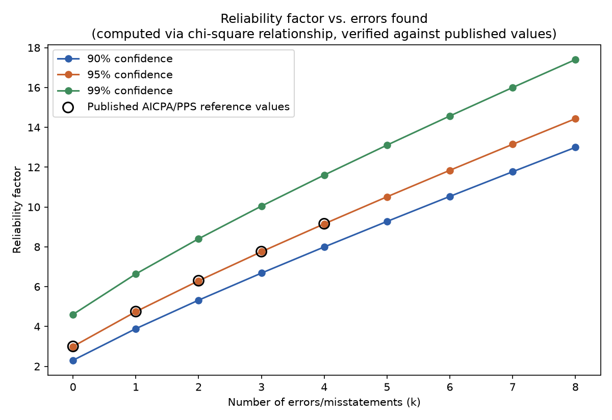

# Statistical Audit Sampling Calculator

Plans and evaluates the two classic audit sampling methods — **attribute
sampling** (tests of controls: did this control operate, yes/no) and
**monetary-unit/PPS sampling** (substantive testing: is this account balance
fairly stated) — using the actual statistical relationship behind the
published reference tables, not a rough approximation, verified against 10
real published table values before being used for anything else.

## Methodology and sources

Both methods share one underlying primitive: the **reliability factor** (also
called a confidence or Poisson factor) — the sample size a Poisson error-count
process needs to support a given confidence level for a given number of
errors. It has an exact, documented closed-form relationship to the
chi-square distribution:

```
reliability_factor(k, confidence) = chi2.ppf(confidence, df = 2*(k+1)) / 2
```

This is the mathematical relationship underlying the AICPA *Audit Guide:
Audit Sampling* reliability-factor tables (used for both attribute and
monetary-unit sampling), which is the primary technical reference for these
methods in US audit practice. The IIA (*Internal Auditor* magazine,
"Attribute Sampling Plans," theiia.org) and ISACA (*IS Auditing Guideline
G10: Audit Sampling*) both direct auditors to this same four-parameter
framework — confidence level, tolerable rate/misstatement, expected
rate/misstatement, population — rather than a different set of formulas.
Sampling statistics are shared across the profession; what differs by
standard-setter is scope (external financial-statement audit vs. internal
audit vs. IS audit) and terminology, not the underlying math. Full-text
access to some of ISACA's and IIA's own hosted documents was blocked during
research (403 responses / a stale subdomain); their content is cited from
what was directly retrievable plus corroborating secondary sources, not
claimed as independently re-verified word for word the way the AICPA
numbers below are.

**Verified before use, not assumed correct:** `check.py` checks
`reliability_factor()` against 10 real published AICPA/PPS reliability-factor
table values — the zero-error row across five risk-of-incorrect-acceptance
levels (1%/5%/10%/15%/20%), and the 0-4 error rows at 95% confidence —
cross-corroborated from multiple independent secondary sources during
research. All 10 match to within 0.0074 of the published (2-decimal-rounded)
value — see `output/report.json`'s `reliability_factor_verification` and the
chart below.



**One honest scope limit, stated plainly:** MUS/PPS sample-size *planning*
with a nonzero expected misstatement uses a simplified, conservative
adjustment (`sampling.py`: subtract expected misstatement from tolerable
misstatement before applying the zero-misstatement reliability factor)
rather than the AICPA guide's more granular expected-misstatement
expansion-factor table. A real worked example found during research (85%
confidence, an expected/tolerable misstatement ratio of 0.20) implied a
table value this module's formula-based approach doesn't reproduce, and
shipping an unverified guess at that specific sub-table would contradict the
point of grounding this project in verified methodology. Sample
**evaluation** for both methods, and MUS **planning at zero expected
misstatement**, use the exact, verified relationship — this approximation
affects only nonzero-expected-misstatement MUS planning.

## The two methods

**Attribute sampling** — plan: iteratively find the smallest sample size
whose reliability factor (for the expected number of deviations at that
size) divided by the sample size doesn't exceed the tolerable deviation
rate — the same construction used to build the classic AICPA attribute
table. Evaluate: computed upper deviation rate (CUDR) = reliability
factor(deviations actually found, confidence) / sample size; compare to the
tolerable rate.

**Monetary-unit (PPS) sampling** — plan: sample size = population value ×
reliability factor(0, confidence) / tolerable misstatement. Select: real
systematic monetary-unit ("cumulative monetary amount") selection over the
population — an unambiguous, universally-taught mechanical method, not part
of the verification above since it isn't itself a statistical table. Evaluate:
basic precision (sampling interval × reliability factor for zero errors) +
projected misstatement (tainting × sampling interval, per identified
misstatement) + incremental allowance (projected misstatement × the marginal
increase in reliability factor for each misstatement, ranked by tainting,
largest first) = upper misstatement limit; compare to tolerable misstatement.

## Worked examples (real output, `output/report.json`)

Both run against small illustrative synthetic populations
(`generate_populations.py`) — the sampling *math* is the verified part; the
input data only exists to make it concrete and inspectable, same as this
portfolio's other projects.

**Attribute sampling** — were purchase orders properly approved? 3,000-PO
population, 95% confidence, 5% tolerable deviation rate, 2% expected rate →
plan calls for a 156-item sample. An actual random sample of that size was
drawn (fixed seed) from the population, which has 62 real seeded approval
deviations (2.07%) scattered through it: **2 deviations landed in the
sample**, giving a computed upper deviation rate of 4.04% — under the 5%
tolerable rate, so the control is supported.

**MUS/PPS sampling** — is the $4,587,449 AR balance fairly stated? 90%
confidence, $115,000 tolerable misstatement (2.5% of the balance), $0
expected misstatement → plan calls for a 92-item sample (sampling interval
$49,864). Real systematic PPS selection over the 420-account population (5
of which carry a real seeded overstatement) happened to select **one** of
them: `AR-0373`, book value $42,565.28 vs. audited value $36,180.49 (15%
tainting). Evaluated: basic precision $114,815 + projected misstatement
$7,480 + incremental allowance $11,871 = **upper misstatement limit
$134,166 — exceeds the $115,000 tolerable misstatement.** The balance is
*not* supported at the stated confidence — a real fail conclusion from one
real selected exception, not smoothed into a pass.

## Running it

```bash
python -m venv .venv
.venv/Scripts/pip install -r requirements.txt   # Windows; .venv/bin/pip on macOS/Linux
.venv/Scripts/python generate_populations.py
.venv/Scripts/python check.py
```

`sampling.py` is a standalone, reusable module (`plan_attribute_sample`,
`evaluate_attribute_sample`, `plan_mus_sample`, `select_pps_sample`,
`evaluate_mus_sample`) — usable directly against a real population without
the illustrative generator. `check.py` writes `output/report.json` (full
verification + both worked examples) and `output/chart.png`.
