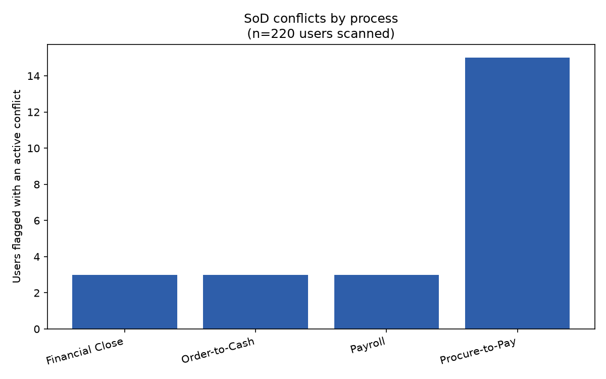

# Segregation-of-Duties Conflict Checker

Flags users who hold both sides of a defined segregation-of-duties (SoD)
conflict — e.g. the ability to both create a vendor master record and
approve payments to it — based on their **current active access**, not raw
grant history. Classic IT-audit/GRC analytics: role designs can look clean
on paper while individual users accumulate conflicting access over time
through exception grants or a role change that was never fully unwound.

## Data

**Synthetic, not real access data.** `generate_access_data.py` generates a
220-user population across 13 clean, single-duty roles (AP Clerk,
Procurement Buyer, Payroll Admin, GL Accountant, etc. — each mapped to
exactly one access right, deliberately conflict-free by design) plus one
role, `Legacy Regional Admin`, that bundles two conflicting rights on
purpose. On top of that clean baseline, three scenarios get seeded
(`data/ground_truth.json`, kept separate from `data/access_grants.csv` —
`check.py` never reads it):

1. **Exception-grant conflict (18 users)** — a clean base role, plus one
   *active* exception grant for the other side of a conflict pair. This is
   the "accumulated access" case the source wiki note calls out as the real
   audit-analytics deliverable — the role definition is fine; the actual
   person isn't.
2. **Role-design conflict (6 users)** — assigned the `Legacy Regional Admin`
   role directly, which bundles both sides of the vendor-master/payment-
   approval conflict by design, not through any individual's exception.
3. **Remediated conflict (10 users)** — an exception grant for the other
   side of a conflict pair that was later **revoked**, well before the
   analysis date. A true-negative case: these users' *grant history*
   contains a conflict, but their *current* access doesn't, and shouldn't
   be flagged.

## Method

`data/conflict_matrix.json` defines six incompatible-duty pairs across four
processes — this is the real audit-test criteria, loaded and used directly
by `check.py` (unlike ground truth, it isn't a secret):

| Process | Conflict | Risk |
|---|---|---|
| Procure-to-Pay | Create/Edit Vendor Master ↔ Approve Vendor Payment | Ghost-vendor scheme |
| Procure-to-Pay | Create Purchase Order ↔ Approve Purchase Order | Self-approved PO |
| Procure-to-Pay | Create Purchase Order ↔ Receive Goods | Fictitious receipt |
| Order-to-Cash | Create/Edit Customer Master ↔ Approve Credit Memo | Fictitious write-off |
| Payroll | Edit Payroll Rates/Hours ↔ Approve Payroll Run | Unauthorized pay change, self-approved |
| Financial Close | Post Journal Entry ↔ Approve Journal Entry | Self-approved manual JE |

`check.py` filters every access grant to what's **active as of the analysis
date** (not revoked), groups by user into each person's current right-set,
and flags anyone whose active rights cover both sides of any pair —
regardless of whether those rights came from a role, an exception grant, or
a mix of both.

## Findings (real output, `output/flagged.json` / `output/chart.png`)

Run against the generated 220-user population, 244 active access grants:

| Metric | Value |
|---|---|
| Users scanned | 220 |
| Users flagged with an active conflict | 23 |
| Total conflict flags raised | 24 |
| Recall vs. seeded active-conflict users (exception + role-design) | 24/24 (100%) |
| Precision (flags tracing to a real seeded case) | 24/24 (100%) |
| Remediation specificity (revoked-access users correctly left unflagged) | 10/10 (100%) |



**A real, non-gamed finding, not an engineered one:** 23 users flagged
across 24 flags — one user, `U-0057` (a Procurement Buyer), was flagged
*twice*. Two independent random exception grants happened to land on the
same person: `Approve Purchase Order` and `Receive Goods`, on top of their
base `Create Purchase Order` right. That's not two separate minor issues —
it's one person who can create a purchase order, approve it, *and* receive
the goods against it, the full procure-to-pay cycle end to end with zero
independent checkpoint. Worth flagging in a real writeup as the kind of
compounding risk a pairwise conflict matrix can under-communicate if you
only look at pair counts instead of per-user risk concentration.

**What "clean" 100s actually mean here, stated plainly**: unlike a fuzzy
name-match or a statistical-rarity threshold, every check in this project
is exact set membership — a user either currently holds both named rights
or doesn't. There's no tunable threshold to get wrong, so a clean result
mainly validates that the active-vs-revoked filtering and the role/exception
bookkeeping are implemented correctly, which is exactly what the remediated-
conflict scenario was built to stress-test (get that filter wrong, e.g. by
matching on grant history instead of current state, and the specificity
number above would have dropped immediately). It is not a claim that a real
identity-management extract is this clean to analyze — real UAR (user
access review) data is messier: informal/undocumented exception grants,
inconsistent role-naming across systems, and shared/service accounts all
make the "get every user's current right-set" step itself the hard part in
practice, not the matrix comparison. Same validated-baseline framing this
portfolio's other two analytics projects use for their own results.

## Running it

```bash
python -m venv .venv
.venv/Scripts/pip install -r requirements.txt   # Windows; .venv/bin/pip on macOS/Linux
.venv/Scripts/python generate_access_data.py
.venv/Scripts/python check.py
```

Writes `data/access_grants.csv` (the checker's input), `data/conflict_matrix.json`
(the real test criteria), and `data/ground_truth.json` (seeded cases, for
scoring only) from the first command; `output/flagged.json` (all flags plus
the precision/recall/specificity scoring) and `output/chart.png` (flagged
users by process) from the second.
